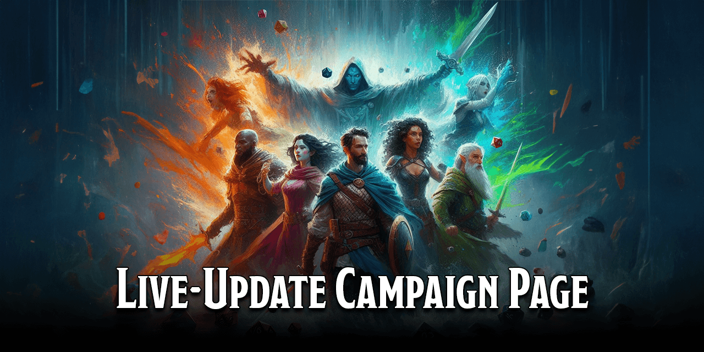

# D&D Beyond Live-Update Campaign Page

   

**D&D Beyond Live-Update Campaign Page** is a script that allows you to view live data about each of the characters in a D&D Beyond campaign from the Campaign page itself.

- [D\&D Beyond Live-Update Campaign Page](#dd-beyond-live-update-campaign-page)
  - [1. Prerequisites](#1-prerequisites)
  - [2. How to Install and Set-up](#2-how-to-install-and-set-up)
  - [3. How to Use](#3-how-to-use)
  - [4. Credits](#4-credits)
  - [5. License](#5-license)

## 1. Prerequisites

To use this script, you will need a browser extension that allows you to run User Scripts. There a numerous available to choose from, including:

| Extension | Browser Support |
| --- | --- |
| [Firemonkey](https://addons.mozilla.org/en-US/firefox/addon/firemonkey/) |  |
| [Greasemonkey](https://www.greasespot.net/) |  |
| [Tampermonkey](https://www.tampermonkey.net/) |      |
| [Violentmonkey](https://violentmonkey.github.io/) |    |

Install one of these extensions for your browser. If you're not sure, I recommend Tampermonkey.

## 2. How to Install and Set-up

**WARNING: CURRENTLY UNDER DEVELOPMENT - NOT FUNCTIONING - COME BACK LATER**

[Click on this link](https://github.com/FaithLilley/DnDBeyond-Live-Campaign/raw/master/ddb-live-campaign.user.js) to install this user script to your browser extension, then follow the instructions from your browser extension.

## 3. How to Use

1. Open your [campaigns page on the D&D Beyond website](https://www.dndbeyond.com/my-campaigns).
2. Click on one of your campaigns.

You'll now see additional information displayed on the card of each character, showing:

- Current Hit Points
- Current Armor Class
- Ability Scores
- Passive Perception / Investigation / Insight

The data is automatically updated every 60 seconds.

## 4. Credits

Author: Faith Elisabeth Lilley (aka Stormknight)

Project forked from [DNDBeyond-DM-Screen](https://github.com/TeaWithLucas/DNDBeyond-DM-Screen) by [TeaWithLucas](https://github.com/TeaWithLucas) - huge thanks for figuring out the jQuery code.

## 5. License

This project uses the [MIT license](LICENSE.md).